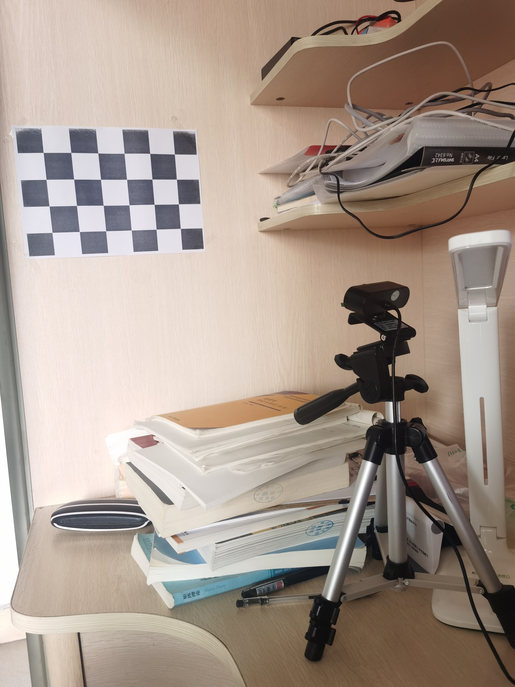
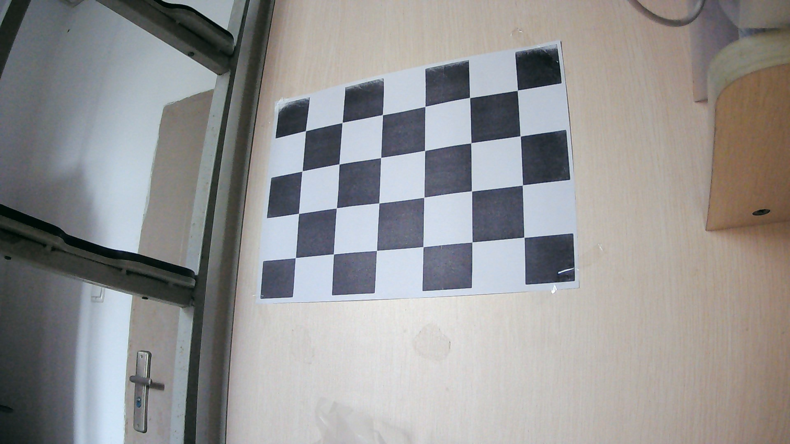

## opencv相机标定-孙佳伟（202122060713）

项目地址：https://github.com/sinary-sys/computer_vision/tree/master/first_work/code

[TOC]

本次相机标定采用的设备



OpenCV使用棋盘格板进行标定（如下图），为了标定相机，我们需要输入一系列三维点和它们对应的二维图像点。在黑白相间的棋盘格上，二维图像点很容易通过角点检测找到。而对于真实世界中的三维点呢？由于我们采集中，是将相机放在一个地方，而将棋盘格定标板进行移动变换不同的位置，然后对其进行拍摄。所以我们需要知道(X,Y,Z)的值。但是简单来说，我们定义棋盘格所在平面为XY平面，即Z=0。对于定标板来说，我们可以知道棋盘格的方块尺寸。




### 1、使用glob模块将所有的图片读进来

```python
images = glob.glob('../pictures/*.jpg')
```

### 2、标定棋盘格角点检侧

`cv2.cornerSubPix`函数实现代码：

```python
corners	= cv.cornerSubPix( image, corners, winSize, zeroZone, criteria	)
```

参数：
`image`：输入图像，8位或者float型。
`corners`：角点初始坐标。
`winsize`：搜索窗口为`2*winsize+1`。
`zerozone`：死区，不计算区域，避免自相关矩阵的奇异性。没有死区，参数为（-1，-1）
`criteria`：求角点的迭代终止条件。
返回值：
`corner`：角点位置。
显示角点位置：`cv.drawChessboardCorners`

```
image	=cv.drawChessboardCorners(image, patternSize, corners, patternWasFound	)
```
`patternWasFound`：标志位，检测是否所有board都被检测到，若为是，则将角点连线，否则不连线。

### 3、标定、去畸变

通过上面的步骤，我们得到了用于标定的三维点和与其对应的图像上的二维点对。我们使用**cv2.calibrateCamera()**进行标定，这个函数会返回标定结果、相机的内参数矩阵、畸变系数、旋转矩阵和平移向量。

```python
retval, cameraMatrix, distCoeffs, rvecs, tvecs	=	
                                    cv.calibrateCamera(
                                    objectPoints, imagePoints, imageSize, cameraMatrix, 
                                    distCoeffs[, rvecs[, tvecs[, flags[, criteria]]]]
）
```

`objectPoints`：世界坐标系里的位置。
`imagePoints`： 像素坐标。
`imageSize`：为图像的像素尺寸大小。
`cameraMatrix`：3*3矩阵，相机内参数矩阵。
`disCoeffs`：畸变矩阵
`rvecs`：旋转向量
`tvecs`：位移向量
`flags`：标定采用的算法
`criteria`：迭代终止条件设定。
纠正图像：
我们已经得到了相机内参和畸变系数，在将图像去畸变之前，我们还可以使用`cv.getOptimalNewCameraMatrix()`优化内参数和畸变系数，通过设定自由自由比例因子alpha。当alpha设为0的时候，将会返回一个剪裁过的将去畸变后不想要的像素去掉的内参数和畸变系数；当alpha设为1的时候，将会返回一个包含额外黑色像素点的内参数和畸变系数，并返回一个ROI用于将其剪裁掉。

```python
retval, validPixROI = cv.getOptimalNewCameraMatrix(	
                        cameraMatrix, distCoeffs, imageSize, 
                        alpha[, newImgSize[, centerPrincipalPoint]]	)

```

`imageSize`：原始图像尺寸。
`newImageSize`：校正后图像尺寸。
`alpha`：取0或1。
`centerPrincipalPoint`：是否作用于中心，默认为opencv自己根据图像选择位置。

